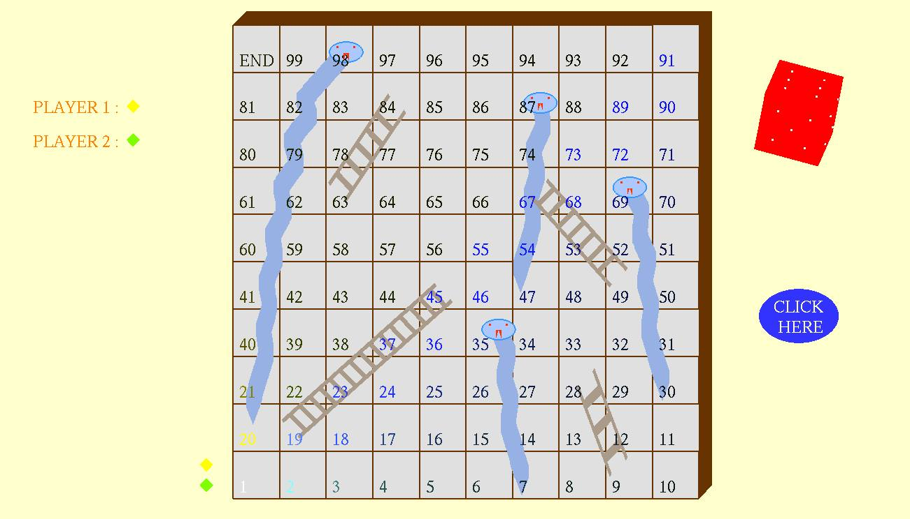

# Snake-And-Ladder-3D
An OpenGL API based Snake and Ladder 3D game :
`Developed Snake & Ladder 3D Desktop Application for Windows and Linux systems usingC++  Open GL Graphics Library that involved Object Oriented Programming Concepts`

Contributors : Manjunath S Horapeti & Mohammed Ibrahim B

Screenshots -
 

 

